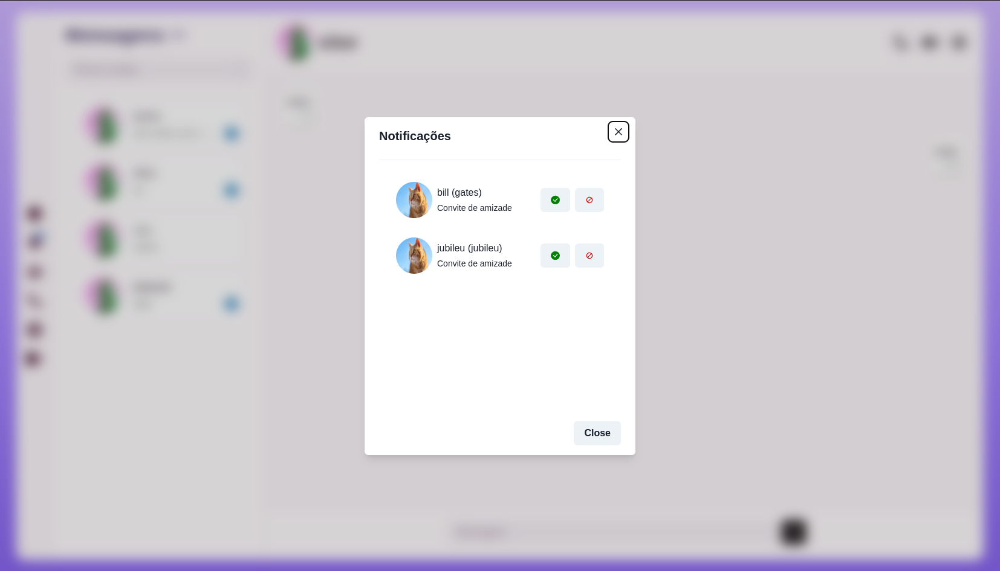
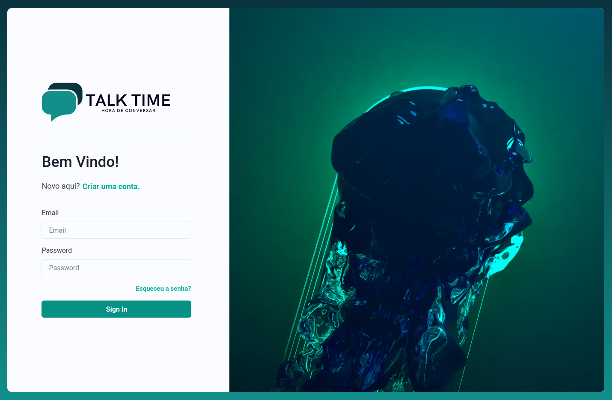
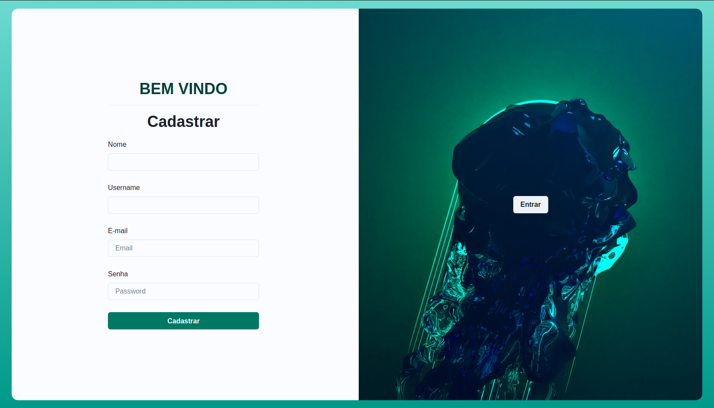

<h4 align="movielist"> 
	🚧 Em desenvolvimento... 🚧
</h4>

<!-- ABOUT THE PROJECT -->
## Sobre o projeto
Este projeto é uma aplicação de chat desenvolvida com o objetivo de estudos. Nele, abordamos conceitos como Clean Architecture, SOLID, TDD, DDD, Microserviços, Mensageria, Estratégias de Cache, Comunicação em Tempo Real, Escalabilidade e Resiliência.

## Microserviços e Escalabilidade
O back-end da nossa aplicação foi desenvolvido utilizando microserviços em Node.js e C# ASP.NET Core 7. Essa abordagem nos permite dividir a lógica em serviços independentes, tornando o sistema mais flexível e escalável. Cada microserviço é responsável por uma funcionalidade específica, como autenticação, gerenciamento de contatos e troca de mensagens.

Para possibilitar a comunicação entre esses microserviços, utilizamos um mecanismo de mensageria. Através dessa abordagem, os serviços trocam mensagens entre si, permitindo a coordenação e o compartilhamento de informações de forma assíncrona e desacoplada. Essa comunicação baseada em mensageria contribui para uma arquitetura distribuída mais robusta e resiliente.

## 🚀Tecnologias utilizadas
Back-end
* [Node](https://nodejs.org/en)
* [C# ASP.NET Core 7](https://learn.microsoft.com/en-us/aspnet/core/release-notes/aspnetcore-7.0?view=aspnetcore-7.0)
* [Entity Framework](https://learn.microsoft.com/pt-br/ef/)
* [TypeScript](https://www.typescriptlang.org/)
* [MongoDB](https://www.mongodb.com/)
* [Redis](https://redis.io/)
* [Kafka](https://kafka.apache.org/)
* [Kafka Connect](https://docs.confluent.io/platform/current/connect/index.html)
* [Postgres](https://www.postgresql.org/)
* [Jest](https://jestjs.io/pt-BR/)
* [xUnit](https://xunit.net/)

Front-end
* [ReactJS](https://pt-br.reactjs.org/)
* [TypeScript](https://www.typescriptlang.org/)
* [Vite](https://vitejs.dev/)
* [Jest](https://jestjs.io/pt-BR/)
* [Chakra-Ui](https://chakra-ui.com/)
 
## Tela principal
<h1 align="center">
  
</h1>

## Modal de notificações
<h1 align="center">
  
</h1>

## Modal para pesquisa de novos contatos
<h1 align="center">
  
</h1>

## Tela de login
<h1 align="center">
  
</h1>

## Tela de cadastro
<h1 align="center">
  
</h1>

## Deseja testar?

1 - Para isso basta ir até a pasta environment abrir o terminal e rodar o comando

**docker-compose up**
#
2 - Acesse o url http://localhost:9021/

3 - Quando carregar vá até a opção connect na barra lateral, depois clique em 
connect-default.

4 - Agora clique em Upload connector config file, vá até a pasta environment selecione postgresql.properties e confirme, role a página até o final e clique em
next, depois em launch, caso nada tenha aparecido na tela aperte F5.

5 - Repita o passo 4 para mongo-sink-postgresql.properties e depois para mongo-sink-postgresql-messager.properties

6 - Com tudo finalizado basta acessar a url http://localhost:8081

### Observação (Quando adicionar um contato e ele aceitar atualize a página para que ele possa aparecer na sua lista de contatos)

O bug mencionado será corrigido na próxima atualização

